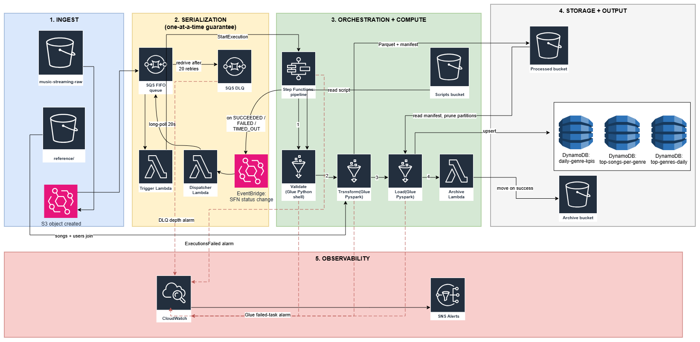

# Music Streaming ETL — Terraform IaC

End-to-end AWS data pipeline provisioned with Terraform.



For a guided tour of the diagram — what the five zones mean, how to read the arrows, and why each piece exists — see [WALKTHROUGH.md → Reading the architecture diagram](WALKTHROUGH.md#reading-the-architecture-diagram). 

<details>
<summary>Text-only flow (screen-reader friendly)</summary>

```
S3 (raw)  →  EventBridge  →  SQS FIFO  →  Trigger Lambda  →  Step Functions  →  Glue Validate
                                                                              →  Glue Transform  →  S3 Processed (Parquet)
                                                                              →  Glue Load       →  DynamoDB (3 KPI tables)
                                                                              →  Archive Lambda  →  S3 Archive
                                                                                                  ↓ on failure
                                                                                                CloudWatch  →  SNS
```

</details>

The SQS FIFO + Trigger Lambda layer **serializes pipeline executions** — only one ETL run happens at a time, regardless of how many files land in S3 simultaneously. This prevents race conditions where parallel runs would overwrite each other's DynamoDB writes.

**Partition pruning (Transform → Load hand-off):** Transform writes a small JSON manifest at `s3://<processed_bucket>/manifests/<file>.json` listing the `listen_date`s it just produced. Load reads that manifest and filters its Parquet scan to only those dates — so Load's runtime stays constant as `processed/` grows.

**Failure surfaces:**
- CloudWatch alarm on the SQS dead-letter queue → SNS email if any message lands there
- CloudWatch alarm on each Glue job's failed-task metric → SNS email
- CloudWatch alarm on Step Functions `ExecutionsFailed` → SNS email
- All Lambdas have explicit boto3 timeouts so they fail fast instead of hanging on the default 60s socket timeout
- All S3 calls use `ExpectedBucketOwner` (confused-deputy guardrail)

---

## Directory layout

```
terraform/
├── envs/
│   └── develop/                  # Develop environment — root of `terraform apply`
│       ├── backend.tf            # Remote state config (env-scoped key)
│       ├── providers.tf
│       ├── variables.tf
│       ├── main.tf               # Wires the modules together
│       ├── outputs.tf
│       └── terraform.tfvars.example
├── modules/                      # Shared across all envs
│   ├── iam/                      # Least-privilege roles
│   ├── s3/                       # 4 buckets + reference data upload
│   ├── dynamodb/                 # 3 KPI tables
│   ├── sqs/                      # FIFO queue + DLQ (serialization)
│   ├── lambda/                   # Archive Lambda
│   ├── pipeline_trigger/         # SQS → Step Functions trigger Lambda
│   ├── glue/                     # Catalog DB + 3 jobs + script uploads
│   ├── step_functions/           # Orchestration state machine
│   ├── eventbridge/              # S3 → SQS trigger rule
│   └── monitoring/               # CloudWatch alarms + SNS topic
├── scripts/
│   ├── setup-backend.sh          # Bootstrap remote S3 state (bash)
│   ├── teardown-backend.sh
│   ├── setup-backend.ps1         # Same, for Windows PowerShell
│   ├── teardown-backend.ps1
│   ├── glue/                     # validate.py, transform.py, load.py
│   └── lambda/                   # archive.py, pipeline_trigger.py
└── tests/                        # Unit tests — pytest + moto + PySpark
    ├── conftest.py               # sys.path + session SparkSession fixture
    ├── pytest.ini
    ├── requirements-test.txt
    ├── lambda_tests/             # test_archive.py, test_pipeline_trigger.py
    └── glue_tests/               # test_validate.py, test_transform.py, test_load.py
```

Each environment under `envs/` has its own `backend.tf` so develop / staging / prod state files never collide. The state **bucket** is shared across all envs; the state **key** is env-scoped (e.g. `etl/music-streaming/develop/terraform.tfstate`).

---

## Prerequisites

1. **Terraform** ≥ 1.5.0 (`terraform -version`)
2. **AWS CLI** configured with credentials that can create IAM, S3, DynamoDB, Glue, Step Functions, Lambda, EventBridge, CloudWatch, SNS resources.
3. **Python 3** on PATH (used by the teardown script to delete versioned objects in bulk).
4. The local data folder must exist at the path configured in `var.reference_data_path` (default: `../../../Project 1 -- ETL with s3, dynamo and glue/data`, resolved from `envs/develop/`).

---

## Deployment

### Step 0 — Bootstrap remote state (one-time, per environment)

Before the first `terraform init`, run the backend bootstrap script. It provisions the S3 state bucket and rewrites `envs/develop/backend.tf` with the real bucket name + region.

**Bash / Git Bash / WSL:**
```bash
cd terraform
./scripts/setup-backend.sh                    # defaults: env=develop, region=eu-west-1
# or, for another env / region:
./scripts/setup-backend.sh --env=develop --region=eu-west-1
```

**PowerShell (Windows):**
```powershell
cd terraform
.\scripts\setup-backend.ps1                   # defaults: env=develop, region=eu-west-1
# or:
.\scripts\setup-backend.ps1 -Env develop -Region us-east-1
```

The bucket name is `music-streaming-tfstate-<your-account-id>` and is shared across every environment you bootstrap; the script is idempotent and skips creation if the bucket already exists.

### Step 1 — Configure inputs

**PowerShell:**
```powershell
cd envs\develop
Copy-Item terraform.tfvars.example terraform.tfvars
# Edit terraform.tfvars and set alert_email (required)
```

**Git Bash / WSL:**
```bash
cd envs/develop
cp terraform.tfvars.example terraform.tfvars
# Edit terraform.tfvars and set alert_email (required)
```

### Step 2 — Init, plan, apply

Same commands in either shell:

```bash
# Still in envs/develop
terraform init                # downloads providers, configures remote backend
terraform plan                # dry run — read this carefully on first apply
terraform apply               # builds the pipeline (~3-5 min)
```

After apply finishes:

* **Check your email** for the AWS SNS subscription confirmation. Click the link — failure alerts will not fire until confirmed.
* Run `terraform output` to see bucket names, the state machine ARN, and the SQS trigger queue URL.

---

## Unit tests

Run before deploying changes — fast, no AWS account needed. Same commands work in PowerShell, Git Bash, or WSL.

```bash
# One-time setup (creates venv optional but recommended)
pip install -r tests/requirements-test.txt

# All tests
pytest tests

# Lambda tests only (fast — ~2 seconds, no Spark startup)
pytest tests/lambda_tests

# Skip Spark tests in environments without Java
pytest tests -m "not spark"
```

The full test suite covers:
- **Both Lambdas** (`archive`, `pipeline_trigger`) with moto-mocked S3 / Step Functions / SQS
- **`validate_csv`** pure function with parameterized happy/sad path cases
- **`enrich_streams`** + all 3 KPI computation functions with a local SparkSession

See [tests/README.md](tests/README.md) for the full guide, including CI snippets.

---

## Testing the pipeline

Upload a stream CSV under the `streams/` prefix in the raw bucket. The `streams/` prefix is required — that's the EventBridge filter.

**PowerShell:**
```powershell
# From envs\develop, get the raw bucket name
$RAW_BUCKET = terraform output -raw raw_bucket_name

# Upload one of the sample stream files
aws s3 cp "..\..\..\Project 1 -- ETL with s3, dynamo and glue\data\streams\streams1.csv" `
          "s3://$RAW_BUCKET/streams/streams1.csv"
```

**Git Bash / WSL:**
```bash
# From envs/develop, get the raw bucket name
RAW_BUCKET=$(terraform output -raw raw_bucket_name)

# Upload one of the sample stream files. Quote the path because of spaces.
aws s3 cp "../../../Project 1 -- ETL with s3, dynamo and glue/data/streams/streams1.csv" \
          "s3://$RAW_BUCKET/streams/streams1.csv"
```

Confirm the upload landed under `streams/` in the raw bucket — that prefix is what EventBridge filters on, so anything outside it is silently ignored:


Watch the execution in the AWS console:

* **Step Functions → State machines →** `music-streaming-develop-pipeline` → click the latest execution. You'll see Validate → Transform → Load → Archive light up green.

  

  Each upload becomes one execution in the list (serialized by the SQS FIFO layer, so they run back-to-back, never in parallel):

  

* **DynamoDB → Tables** → open each of the 3 KPI tables and verify items appear under the matching date partition.

  

* **S3 → archive bucket** → the original file should now be there; it should be gone from the raw bucket. After two pipeline runs, both source files end up under `archive/streams/`:

  

---

## Querying the KPI data

After the pipeline runs, three DynamoDB tables hold the daily analytics. Use `--output table` plus `--query` to reach through the type wrappers (`.S` / `.N`) and get clean tabular output.

For the full cheat sheet — including PowerShell variants, boto3 examples, and JMESPath tips — see [docs/sample-queries.md](docs/sample-queries.md).

### Table schemas

| Table | Partition key | Sort key | Other columns |
|---|---|---|---|
| `music-streaming-dev-daily-genre-kpis` | `genre` (S) | `date` (S) | `listen_count`, `unique_listeners`, `total_listening_time_ms`, `avg_listening_time_per_user_ms` |
| `music-streaming-dev-top-songs-per-genre` | `genre` (S) | `date_rank` (S, e.g. `"2024-06-25#01"`) | `track_id`, `track_name`, `listen_count`, `rank`, `date` |
| `music-streaming-dev-top-genres-daily` | `date` (S) | `rank` (S, e.g. `"01"`) | `genre`, `listen_count` |

### Daily KPIs for one genre, all dates (four metrics)

```bash
aws dynamodb query \
  --table-name music-streaming-dev-daily-genre-kpis \
  --key-condition-expression "genre = :g" \
  --expression-attribute-values '{":g":{"S":"pop"}}' \
  --region eu-west-1 \
  --output table \
  --query 'Items[*].{Date: date.S,
                     Listens: listen_count.N,
                     UniqueUsers: unique_listeners.N,
                     TotalMs: total_listening_time_ms.N,
                     AvgMsPerUser: avg_listening_time_per_user_ms.N}'
```

### Top 3 songs for one genre on a date

```bash
aws dynamodb query \
  --table-name music-streaming-dev-top-songs-per-genre \
  --key-condition-expression "genre = :g AND begins_with(date_rank, :d)" \
  --expression-attribute-values '{":g":{"S":"rock"}, ":d":{"S":"2024-06-25#"}}' \
  --region eu-west-1 \
  --output table \
  --query 'Items[*].{Rank: rank.N, Song: track_name.S, Listens: listen_count.N}'
```

### Top 5 genres on a given day

```bash
aws dynamodb query \
  --table-name music-streaming-dev-top-genres-daily \
  --key-condition-expression "#d = :d" \
  --expression-attribute-names '{"#d":"date"}' \
  --expression-attribute-values '{":d":{"S":"2024-06-25"}}' \
  --region eu-west-1 \
  --output table \
  --query 'Items[*].{Rank: rank.S, Genre: genre.S, Listens: listen_count.N}'
```

> **Why `#d` for `date`?** `date` is a reserved word in DynamoDB expressions. The `ExpressionAttributeNames` syntax aliases it.

### Scan everything in a table

For browsing all rows (only safe on small tables):

```bash
aws dynamodb scan \
  --table-name music-streaming-dev-daily-genre-kpis \
  --region eu-west-1 \
  --output table \
  --query 'Items[*].{Genre: genre.S, Date: date.S, Listens: listen_count.N, Users: unique_listeners.N}'
```

### PowerShell variants

Same flags, but escape inline JSON differently — easiest is to put it in a variable first:

```powershell
$KEY = '{":g":{"S":"pop"}}'
aws dynamodb query `
  --table-name music-streaming-dev-daily-genre-kpis `
  --key-condition-expression "genre = :g" `
  --expression-attribute-values $KEY `
  --region eu-west-1 `
  --output table `
  --query 'Items[*].{Genre: genre.S, Date: date.S, Listens: listen_count.N, Users: unique_listeners.N}'
```

---

## Tearing down

Two-step teardown — destroy the application first, then optionally drop the state backend.

**PowerShell:**
```powershell
# 1. Remove every AWS resource the pipeline created
cd envs\develop
terraform destroy

# 2. (Optional) Reset backend.tf to placeholder and KEEP the shared state bucket
cd ..\..
.\scripts\teardown-backend.ps1 -Env develop

# 2b. Or, fully nuke the shared state bucket too (DESTRUCTIVE — wipes ALL envs' state)
.\scripts\teardown-backend.ps1 -Env develop -DeleteBucket
```

**Git Bash / WSL:**
```bash
# 1. Remove every AWS resource the pipeline created
cd envs/develop
terraform destroy

# 2. (Optional) Reset backend.tf to placeholder and KEEP the shared state bucket
cd ../..
./scripts/teardown-backend.sh --env=develop

# 2b. Or, fully nuke the shared state bucket too (DESTRUCTIVE — wipes ALL envs' state)
./scripts/teardown-backend.sh --env=develop --delete-bucket
```

In `develop`, the S3 buckets use `force_destroy = true`, so `terraform destroy` completes cleanly. In `staging`/`prod`, the safety net requires you to empty buckets manually first.

---

## Adding more environments

Copy the develop folder, change the `environment` default, then bootstrap the new env.

**PowerShell:**
```powershell
Copy-Item -Recurse envs\develop envs\staging
# Edit envs\staging\variables.tf — set environment default to "staging"
.\scripts\setup-backend.ps1 -Env staging
cd envs\staging
terraform init
terraform apply
```

**Git Bash / WSL:**
```bash
cp -r envs/develop envs/staging
# Edit envs/staging/variables.tf — set environment default to "staging"
./scripts/setup-backend.sh --env=staging
cd envs/staging
terraform init
terraform apply
```

State files for each env stay isolated under their own key in the shared bucket.

---

## Cost notes

| Resource | Cost driver | Estimate (light dev use) |
|---|---|---|
| Glue ETL jobs (G.1X × 2) | per-DPU-minute | ~$0.44 / 10-min job |
| Glue Python shell | per-DPU-minute | < $0.01 / run |
| DynamoDB (PAY_PER_REQUEST) | per-request | < $1 / month idle |
| Step Functions Standard | per state transition | < $0.50 / month |
| SQS FIFO | per-request | < $0.01 / month at this volume |
| S3 storage + lifecycle | bytes × tier | < $1 / month at sample size |
| Lambda (archive + trigger) | per ms × MB | < $0.01 / month |
| CloudWatch logs | per-GB ingestion | depends on log volume |

A full develop environment running a handful of executions per day should cost well under $10/month.

---

## Common changes

* **Different AWS region** — edit `aws_region` in `terraform.tfvars` AND re-bootstrap the backend with `--region=`/`-Region` so state is stored in the right region.
* **Production deploy** — copy `envs/develop` to `envs/prod`, change the `environment` default to `"prod"`, bootstrap, init, apply.
* **Glue worker scaling** — edit `number_of_workers` in `modules/glue/main.tf`. No code changes needed.
* **Update a Glue script** — edit the `.py` file under `scripts/glue/` and re-run `terraform apply`. The `filemd5()` etag triggers a re-upload.
